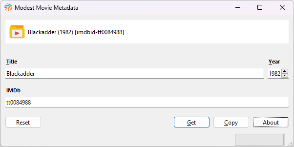

# Modest Movie Metadata

**`This is a forked repo of the tool has all audio files removed per personal preference and other quality-of-life tweaks which will be documented here soon.`**  

A very simple tool to generate [Jellyfin](https://jellyfin.org/) folder names using data from IMDb.  

By way of example, for the television show [Blackadder](https://www.imdb.com/title/tt0084988/), this tool will generate the folder name `Blackadder (1982) [imdbid-tt0084988]`:  

  

## How-to / Usage  

Designed to be as efficient as possible, you can use it hands-free:

- It will monitor the clipboard for IMDb IDs, e.g. within a URL.
- Can automatically write generated folder names to the clipboard.

If you prefer, you can enter only the title and year, and attempt to look up the IMDb ID using this tool.  
However, in practice, *it is typically easier to search for the content on the IMDb website using a web browser, and then simply copy the URL to the clipboard.*  

**The program does not create or monitor any files or folders on the file system.**  
**This project is not affiliated with Jellyfin or IMDb!**  

Developed with Python 3.12, PySide 6.6, and [Cinemagoer](https://github.com/cinemagoer/cinemagoer)  
Tested under Windows 10 and 11.  

## Installation  

To install the program on Windows, click on the

[Releases link here in GitHub](https://github.com/damonlynch/modest-movie-metadata/releases),

and download the installer for the latest version.

The installer is only for 64-bit Windows 10 and 11. It should work equally well on Linux and macOS, but to use it you need to know how to install Python packages and run a Python script. If somebody would like to volunteer to produce a macOS installer, I would be delighted (I don’t own a Mac myself). If there is demand, I can create a Linux installer.  

## Licence  

GPL 3.0 or later.  

## Author  

- [@damonlynch](https://www.github.com/damonlynch)  

## Credits  

- Video folder icon created by [Smashicons - Flaticon](https://www.flaticon.com/free-icon/video_6302563).  
- Sound effects from [Pixabay](https://pixabay.com/sound-effects/game-ui-sounds-14857/).